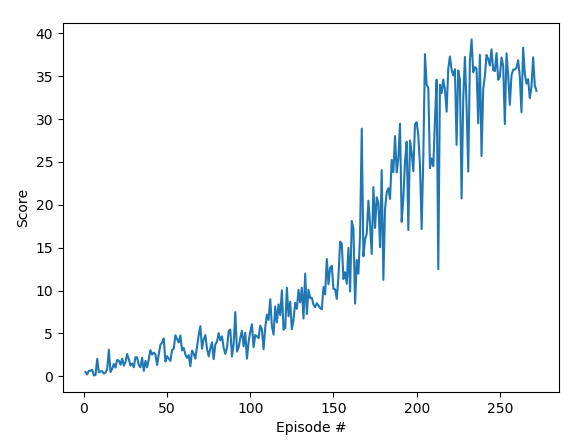

# Code Report
## Learning Algorithm

Our `Agent` uses the actor-critic model with the Deep Deterministic Policy Gradients (DDPG) algorithm. We describe the hyperparameters chosen below:

The hyperparameters chosen for our `Actor` are as follows:
- Input is the size of the state space
- First layer has `256` linear units with `ReLU` activation
- Second layer has `128` linear units with the same activation
- Third (output) layer has size of the action space with `tanh` activation

The hyperparameters chosen for our `Critic` are as follows:
- Input is the size of the state space
- First layer has `256 + action_size` linear units with `ReLU` activation
- Second layer has `128` linear units with the same activation
- Third (output) layer has size of the action space with no (`Linear`) activation

For our `ActorCriticAgent`'s learning process (with experience reply using `ReplayBuffer` and `OUNoise`), our hyperparameters are:
- Learning Rate: `1e-4` (in both DNN)
- Update the network every `4` steps
- Have a discount factor (gamma) of `0.99`
- Use soft update of target parameters (tau) with `1e-3`
- Minibatch size of `128`
- Replay buffer size of `1e5`
- Ornstein-Uhlenbeck noise parameters of `0.15` (theta) and `0.2` (sigma)

## Plot of Rewards

We achieved the required reward of about `+30` after around `250` episodes. These rewards, as observable in `main.py:26` are averaged over a sliding window (deque) of size `100`.

### Training Graph

## Ideas for Future Work

Here are some ideas I'm interested in applying to improve the performance of the agent:

- **D4PG**: Implementing a new (improved) algorithm which is known to achieve state-of-the-art performance will likely improve our agent's average return.
- **Crawler**: Applying these models to a new environment may lead to even better hyperparameter choices that will work in the general case, for other environments.